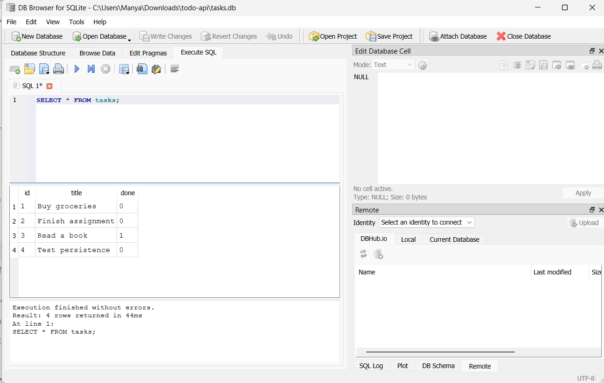

# Task API

A CRUD API for managing a to-do list, built with FastAPI and backed by a SQLite database. Built as part of the AI Fluency Backend track (BE-01, extended in BE-02).

## What this is

A REST API with five endpoints to create, read, update, and delete tasks. Data is stored in a SQLite database (`tasks.db`) — it survives server restarts.

## Why SQLite

SQLite was chosen because it requires no separate database server — the whole database lives in a single file, and Python's built-in `sqlite3` module can read and write it directly. That makes it a good first real database: enough to learn actual SQL, without the setup overhead of running a separate database server.

## Where the database is stored

The database lives in a single file called `tasks.db`, created automatically in the project's root folder the first time the app runs. If the file or the `tasks` table doesn't exist yet, the app creates them; if the table is empty, it seeds 3 example tasks. On every later run, that seeding step is skipped, so restarting the server no longer resets your data.

## How to run it

1. Install Python 3.10+
2. Install dependencies:
   ```
   py -m pip install fastapi uvicorn
   ```
3. Start the server:
   ```
   py -m uvicorn main:app --reload --port 8000
   ```
4. Open `http://localhost:8000/docs` for interactive Swagger UI, or use curl / any HTTP client against `http://localhost:8000`.

## Endpoints

| Method | Path            | Description                          | Success | Errors |
|--------|-----------------|---------------------------------------|---------|--------|
| GET    | `/`             | API info                              | 200     | —      |
| GET    | `/health`       | Health check                          | 200     | —      |
| GET    | `/tasks`        | List all tasks                        | 200     | —      |
| GET    | `/tasks/{id}`   | Get a single task                     | 200     | 404 if not found |
| POST   | `/tasks`        | Create a new task                     | 201     | 400 if title missing/empty |
| PUT    | `/tasks/{id}`   | Replace a task's title and done status| 200     | 400 invalid body, 404 if not found |
| DELETE | `/tasks/{id}`   | Remove a task                         | 204     | 404 if not found |

All endpoints behave exactly as they did in the in-memory version (BE-01) — only the storage layer changed, from a Python list to SQLite.

## Example request

```
curl -i -X POST http://localhost:8000/tasks -H "Content-Type: application/json" -d '{"title":"Buy milk"}'
```

```
HTTP/1.1 201 Created
content-type: application/json

{"id":4,"title":"Buy milk","done":false}
```

## Database viewer

Explored the database directly with DB Browser for SQLite, running queries like:

```sql
SELECT * FROM tasks;
```



Manually updating or deleting rows through the viewer is immediately reflected by the API — the API layer and the storage layer are fully separate; the API just reads and writes whatever is currently in the database.

## Swagger UI

FastAPI generates interactive docs automatically at `/docs`. Every endpoint above is listed there with a "Try it out" button that sends real requests.


## Persistence

Unlike the original in-memory version, task data now survives server restarts. Only the first run (or an empty database) seeds the 3 example tasks — after that, your data stays exactly as you left it.