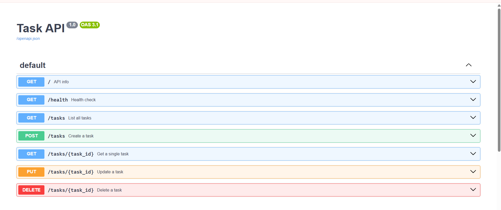

# Task API

A simple RESTful Task Management API built with **FastAPI**. This project demonstrates the complete CRUD (Create, Read, Update, Delete) lifecycle using an in-memory data store.

## Features

* Create a task
* View all tasks
* View a single task by ID
* Update an existing task
* Delete a task
* Input validation
* Proper HTTP status codes
* Interactive Swagger documentation

## Technologies Used

* Python 3
* FastAPI
* Uvicorn
* Pydantic

## Installation

Clone the repository:

```bash
git clone https://github.com/manya09921/task-api.git
cd task-api
```

Install the required packages:

```bash
py -m pip install fastapi uvicorn
```

Run the server:

```bash
py -m uvicorn main:app --reload --port 8000
```

The API will be available at:

* API: http://127.0.0.1:8000
* Swagger UI: http://127.0.0.1:8000/docs

## API Endpoints

| Method | Endpoint           | Description             |
| ------ | ------------------ | ----------------------- |
| GET    | `/`                | API information         |
| GET    | `/health`          | Health check            |
| GET    | `/tasks`           | Get all tasks           |
| GET    | `/tasks/{task_id}` | Get a task by ID        |
| POST   | `/tasks`           | Create a new task       |
| PUT    | `/tasks/{task_id}` | Update an existing task |
| DELETE | `/tasks/{task_id}` | Delete a task           |

## Example Request

### Create a Task

```bash
curl -X POST http://127.0.0.1:8000/tasks ^
-H "Content-Type: application/json" ^
-d "{\"title\":\"Buy milk\"}"
```

Example response:

```json
{
  "id": 4,
  "title": "Buy milk",
  "done": false
}
```

## HTTP Status Codes

* **200 OK** – Successful GET or PUT request
* **201 Created** – Task created successfully
* **204 No Content** – Task deleted successfully
* **400 Bad Request** – Invalid input
* **404 Not Found** – Task not found

## Swagger UI

Interactive API documentation is available at:

http://127.0.0.1:8000/docs

Add your screenshot below after saving it as `swagger.png`.



## Notes

This project uses an **in-memory list** to store tasks. Any tasks created during execution are lost when the server is restarted because no database is used.

## Author

Manya Wadhwa
